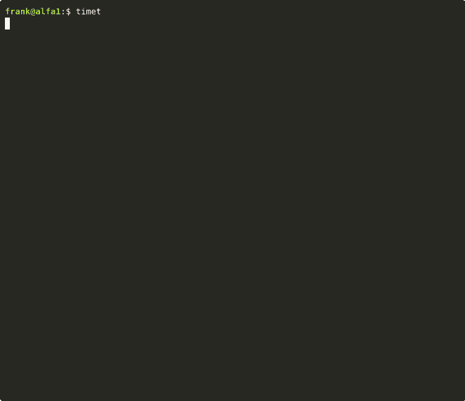

[](https://badge.fury.io/rb/timet)

[](https://codeclimate.com/github/frankvielma/timet/maintainability)
[](https://codeclimate.com/github/frankvielma/timet/test_coverage)

# Timet


## Table of Contents

- [🔑 Key Features](#key-features)
- [✔️ Requirements](#requirements)
- [Examples](#examples)
- [💾 Installation](#installation)
- [⏳ Usage](#usage)
- [📋 Command Reference](#command-reference)
- [🗃️ Data](#️-data)
- [🔒 S3 Cloud Backup Configuration](#-s3-cloud-backup-configuration)
- [Contributing](#contributing)
- [License](#license)


[Timet](https://rubygems.org/gems/timet) is a command-line tool designed to track your activities by recording the time spent on each task. This tool allows you to monitor your work hours and productivity directly from your terminal, eliminating the need for a graphical interface. Essentially, it's a way to log your time spent on different projects or tasks using simple text commands.

<h2 id="key-features">🔑 Key Features:</h2>

- **Local Data Storage:** Timet uses SQLite to store your time tracking data locally, ensuring privacy and security.
- **Lightweight and Fast:** Its efficient design and local data storage make Timet a speedy and responsive tool.
- **Structured Data:** SQLite ensures your data is organized and easily accessible.
- **Scalability:** Timet can handle growing time tracking needs.
- **Data Integrity:** SQLite maintains the accuracy and consistency of your data.
- **Querying and Reporting:** Generate detailed reports for specific periods.
- **CSV Export:** Easily export your time tracking data to CSV format for further analysis or sharing.
- **Pomodoro Integration:** The `pomodoro` option in the `start` command enhances time tracking by integrating the Pomodoro Technique.
- **Block Time Plot:** Visualizes the distribution of tracked time across a specified range of dates. Each column represents the amount of time tracked during a specific hour, with a header showing the hours and a row for each date displaying the time blocks for each hour.
- **Tag Distribution Plot:** Illustrates the proportion of total tracked time allocated to each tag, showing the relative contribution of each tag to the overall time tracked.
- **Detailed Statistics:** Displays detailed statistics for each tag, including total duration, average duration, and standard deviation.
- **iCalendar Export:** Easily export your time tracking data to iCalendar format for integration with calendar applications.
- **S3 Cloud Backup:** Seamlessly backup and sync your time tracking data with S3-compatible storage services, providing an additional layer of data protection and accessibility.

## Examples:



<a name="requirements"></a>
<h2 id="requirements">✔️ Requirements</h2>

- Ruby version: >= 3.0.0
- sqlite3: > 1.7

For older versions of Ruby and Sqlite:

- [Ruby >= 2.7](https://github.com/frankvielma/timet/tree/ruby-2.7.0)
- [Ruby >= 2.4](https://github.com/frankvielma/timet/tree/ruby-2.4.0)

<a name="installation"></a>
## 💾 Installation

Install the gem by executing:

```bash
gem install timet
```

<a name="usage"></a>
## ⏳ Usage

### Command Aliases

- `timet`: The primary command for interacting with the Timet application.
- `tt`: An alias for the `timet` command, providing a shorter alternative.

---

- **`timet start [tag] --notes="" --pomodoro=[minutes]`:** Starts tracking time for a task labeled with the provided [tag], notes, and "pomodoro time" in minutes (optional). Example:

  ```bash
  timet start task1 --notes="Meeting with client" --pomodoro=25

  or

  tt start task1 "Meeting with client" 25
  ```

  ```
  Tracked time report [today]:
  +-------+------------+--------+----------+----------+----------+--------------------------+
  | Id    | Date       | Tag    | Start    | End      | Duration | Notes                    |
  +-------+------------+--------+----------+----------+----------+--------------------------+
  |     1 | 2024-08-09 | task1  | 14:55:07 |        - | 00:00:00 | Meeting with client      |
  +-------+------------+--------+----------+----------+----------+--------------------------+
  |                                           Total:  | 00:00:00 |                          |
  +-------+------------+--------+----------+----------+----------+--------------------------+
  ```

  This command will initiate a 25-minute Pomodoro session for the task "task1" with the provided description.

  ### Pomodoro Integration

  The `pomodoro` option in the `start` command enhances time tracking by integrating the Pomodoro Technique. Users can specify a Pomodoro session length in minutes, like `pomodoro=25`, to start a 25-minute work interval. The app automatically tracks time and notifies users when the interval ends, helping maintain focus.

  **Benefits:**

  - **Flexibility:** Supports various productivity strategies.
  - **Focus:** Encourages disciplined work practices.
  - **Productivity:** Helps achieve higher productivity and better time management.

---

- **`timet stop`:** Stops tracking the current task, records the elapsed time, and displays the total time spent on all tasks.

  ```bash
  timet stop
  ```

  ```
  Tracked time report [today]:
  +-------+------------+--------+----------+----------+----------+--------------------------+
  | Id    | Date       | Tag    | Start    | End      | Duration | Notes                    |
  +-------+------------+--------+----------+----------+----------+--------------------------+
  |     1 | 2024-08-09 | task1  | 14:55:07 | 15:55:07 | 01:00:00 | Meeting with client      |
  +-------+------------+--------+----------+----------+----------+--------------------------+
  |                                           Total:  | 01:00:00 |                          |
  +-------+------------+--------+----------+----------+----------+--------------------------+
  ```

---

- **`timet resume [id]`:** This command allows users to quickly resume tracking a task that was previously in progress. If an ID is provided, it resumes the tracking session for the specified task. If no ID is provided, it resumes the last completed task.

  ```bash
  timet resume 1
  ```

  ```
  Tracked time report [today]:
  +-------+------------+--------+----------+----------+----------+--------------------------+
  | Id    | Date       | Tag    | Start    | End      | Duration | Notes                    |
  +-------+------------+--------+----------+----------+----------+--------------------------+
  |     2 | 2024-08-09 | task1  | 16:15:07 |        - | 00:00:00 | Meeting with client      |
  |     1 |            | task1  | 14:55:07 | 15:55:07 | 01:00:00 | Meeting with client      |
  +-------+------------+--------+----------+----------+----------+--------------------------+
  |                                           Total:  | 01:00:00 |                          |
  +-------+------------+--------+----------+----------+----------+--------------------------+
  ```

---

- **`timet edit`:** Allows users to update a task's notes, tag, start, or end fields. Users can either interactively select the field and provide a new value or specify them directly in the command.

  **Interactive Mode:**

  ```bash
  timet edit 1
  ```

  ```
  Tracked time report [today]:
  +-------+------------+--------+----------+----------+----------+--------------------------+
  | Id    | Date       | Tag    | Start    | End      | Duration | Notes                    |
  +-------+------------+--------+----------+----------+----------+--------------------------+
  |     2 | 2024-08-09 | task1  | 16:15:07 |        - | 00:00:00 | Meeting with client      |
  |     1 |            | task1  | 14:55:07 | 15:55:07 | 01:00:00 | Meeting with client      |
  +-------+------------+--------+----------+----------+----------+--------------------------+
  |                                           Total:  | 01:00:00 |                          |
  +-------+------------+--------+----------+----------+----------+--------------------------+
  Edit Field? (Press ↑/↓ arrow to move and Enter to select)
  ‣ Notes
    Tag
    Start
    End
  ```

  **Direct Specification Mode:**

  ```bash
  timet e 1 notes "New Meeting Notes"
  ```

  ```
  Tracked time report [today]:
  +-------+------------+--------+----------+----------+----------+--------------------------+
  | Id    | Date       | Tag    | Start    | End      | Duration | Notes                    |
  +-------+------------+--------+----------+----------+----------+--------------------------+
  |     2 | 2024-08-09 | task1  | 16:15:07 |        - | 00:00:00 | Meeting with client      |
  |     1 |            | task1  | 14:55:07 | 15:55:07 | 01:00:00 | New Meeting Note         |
  +-------+------------+--------+----------+----------+----------+--------------------------+
  |                                           Total:  | 01:00:00 |                          |
  +-------+------------+--------+----------+----------+----------+--------------------------+
  ```

<a name="command-reference"></a>
## 📋 Command Reference

| Command                                      | Description                                                                 | Example Usage                     |
| -------------------------------------------- | --------------------------------------------------------------------------- | --------------------------------- |
| `timet start [tag] --notes='' --pomodoro=[time]` | Start tracking time for a task labeled [tag] and notes (optional).      | `timet start Task "My notes" 25`  |
| `timet stop`                                 | Stop tracking time.                                                         | `timet stop`                      |
| `timet summary today (t)`                    | Display a report of tracked time for today.                                 | `timet su t` or `timet su`        |
| `timet summary yesterday (y)`                | Display a report of tracked time for yesterday.                             | `timet su y`                      |
| `timet summary week (w)`                     | Display a report of tracked time for the week.                              | `timet su w`                      |
| `timet summary month (m)`                    | Display a report of tracked time for the month.                             | `timet su m`                      |
| `timet su t --csv=[filename]`                | Display a report of tracked time for today and export to CSV file | `timet su t --csv=file.csv`                 |
| `timet su w --ics=[filename]`                | Display a report of tracked time for week and export to iCalendar file | `timet su w --ics=file.csv`            |
| `timet delete [id]`                          | Delete a task by its ID.                                                    | `timet d [id]`                    |
| `timet cancel`                               | Cancel active time tracking.                                                | `timet c`                         |
| `timet edit [id]`                            | Update a task's notes, tag, start, or end fields.                           | `timet e [id]`                    |
| `timet su [date]`                            | Display a report of tracked time for a specific date.                       | `timet su 2024-01-03`             |
| `timet su [start_date]..[end_date]`          | Display a report of tracked time for a date range.                          | `timet su 2024-01-02..2024-01-03` |
| `timet resume (r) [id]`                      | Resume tracking a task by ID or the last completed task.                    | `timet resume [id]`               |
| `timet sync`                                 | Sync local db with remote (S3) external db                                | `timet sync`                      |

### Date Range in Summary

The `timet summary` command now supports specifying a date range for generating reports. This allows users to filter and summarize data within specific date intervals. The date format is in ISO 8601 format (YYYY-MM-DD).

#### Examples:

- **Single Date:** Display a report for a specific date.

  ```sh
  timet su 2024-01-03
  ```

- **Date Range:** Display a report for a date range.

  ```sh
  timet su 2024-01-02..2024-01-03
  ```

<a name="data"></a>
## 🗃️ Data

Timet's data is stored in `~/.timet`.

<a name="s3-cloud-backup-configuration"></a>
## 🔒 S3 Cloud Backup Configuration

Timet supports backing up and syncing your time tracking data with S3-compatible storage services (such as Supabase S3). To configure S3 backup, follow these steps:

### Environment Variables

Create a `.env` file in your project root (`~/.timet`) with the following variables:

```bash
S3_ENDPOINT=your_s3_endpoint_url
S3_ACCESS_KEY=your_access_key
S3_SECRET_KEY=your_secret_key
S3_REGION=your_s3_region
```

### Security Considerations

- Keep your `.env` file private and never commit it to version control
- Use strong, unique access keys
- Regularly rotate your S3 access credentials
- Implement appropriate IAM policies to restrict bucket access


## Development

After checking out the repo, run `bin/setup` to install dependencies. Then, run `rake spec` to run the tests. You can also run `bin/console` for an interactive prompt that will allow you to experiment.

To install this gem onto your local machine, run `bundle exec rake install`. To release a new version, update the version number in `version.rb`, and then run `bundle exec rake release`, which will create a git tag for the version, push git commits and the created tag, and push the `.gem` file to [rubygems.org](https://rubygems.org).

## Contributing

Bug reports and pull requests are welcome on GitHub at [https://github.com/frankvielma/timet](https://github.com/frankvielma/timet). This project is intended to be a safe, welcoming space for collaboration, and contributors are expected to adhere to the [code of conduct](https://github.com/frankvielma/timet/blob/master/CODE_OF_CONDUCT.md).

## Buy Me A Coffee! ☕

Many people have contacted me asking how to contribute. Any contribution, from a virtual coffee to a kind word, is greatly appreciated and helps me continue my work. Please only donate if you're able, as there are no refunds. Your support is entirely voluntary, and I thank you for your consideration.

**Bitcoin Address:**

```sh
bc1qkg9me2jsuhpzu2hp9kkpxagwtf9ewnyfl4kszl
```


---

## License

The gem is available as open source under the terms of the [MIT License](https://opensource.org/licenses/MIT).

## Code of Conduct

Everyone interacting in the Timet project's codebases, issue trackers, chat rooms, and mailing lists is expected to follow the [code of conduct](https://github.com/frankvielma/timet/blob/master/CODE_OF_CONDUCT.md).
