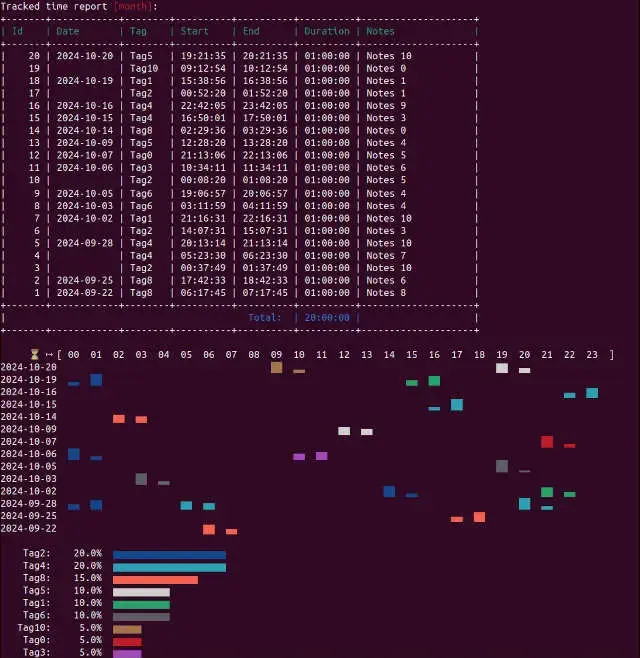

[](https://badge.fury.io/rb/timet)

[](https://codeclimate.com/github/frankvielma/timet/maintainability)
[](https://codeclimate.com/github/frankvielma/timet/test_coverage)

# Timet


Timet refers to a command-line tool designed to track your activities by recording the time spent on each task, allowing you to monitor your work hours and productivity directly from your terminal without needing a graphical interface; essentially, it's a way to log your time spent on different projects or tasks using simple text commands

**Key Features:**

- **Local Data Storage:** Timet utilizes SQLite to store your time tracking data locally, ensuring privacy and security.
- **Lightweight and Fast:** Its efficient design and local data storage make Timet a speedy and responsive tool.
- **Structured Data:** SQLite ensures your data is organized and easily accessible.
- **Scalability:** Timet can handle growing time tracking needs.
- **Data Integrity:** SQLite maintains the accuracy and consistency of your data.
- **Querying and Reporting:** Generate detailed reports for specific periods.
- **CSV Export:** Easily export your time tracking data to CSV format for further analysis or sharing.
- **Pomodoro Integration:** The pomodoro option in the start command enhances time tracking by integrating the Pomodoro Technique.
- **Block Time Plot:** Visualizes the distribution of tracked time across a specified range of dates, with bars in each column representing the amount of time tracked during that specific hour. The plot includes a header showing the hours and a row for each date, displaying the time blocks for each hour.
- **Tag Distribution Plot:** Illustrates the proportion of total tracked time allocated to each tag, showing the relative contribution of each tag to the overall time tracked.

Example:

```bash
Tracked time report [today]:
+-------+------------+--------+----------+----------+----------+--------------------------+
| Id    | Date       | Tag    | Start    | End      | Duration | Notes                    |
+-------+------------+--------+----------+----------+----------+--------------------------+
|    20 | 2024-10-10 | Tag8   | 19:26:58 | 20:26:58 | 01:00:00 | Notes 2                  |
|    19 |            | Tag3   | 07:52:26 | 08:52:26 | 01:00:00 | Notes 7                  |
+-------+------------+--------+----------+----------+----------+--------------------------+
|                                           Total:  | 02:00:00 |                          |
+-------+------------+--------+----------+----------+----------+--------------------------+

⏳ ↦ [ 00  01  02  03  04  05  06  07  08  09  10  11  12  13  14  15  16  17  18  19  20  21  22  23 ]
     [                             ▂▂  ▇▇                                          ▅▅  ▄▄             ]

    Tag8:    50.0%  ▅▅▅▅▅▅▅▅▅▅▅▅▅▅▅▅▅▅▅▅▅▅▅▅▅
    Tag3:    50.0%  ▅▅▅▅▅▅▅▅▅▅▅▅▅▅▅▅▅▅▅▅▅▅▅▅▅
```



## Requirements

- Ruby version: >= 3.0.0
- sqlite3: > 1.7

Old versions of Ruby and Sqlite:

- [Ruby >= 2.7](https://github.com/frankvielma/timet/tree/ruby-2.7.0)

- [Ruby >= 2.4](https://github.com/frankvielma/timet/tree/ruby-2.4.0)

## Installation

Install the gem by executing:

```bash
gem install timet
```

## Usage

### Command Aliases

- `timet`: The primary command for interacting with the Timet application.
- `tt`: An alias for the `timet` command, providing a shorter alternative.

---
- **timet start [tag] --notes="" --pomodoro=[minutes]**: Starts tracking time for a task labeled with the provided [tag],  notes and "pomodoro time" in minutes (optional). Example:

  ```bash
  timet start task1 --notes="Meeting with client" --pomodoro=25

  or

  tt start task1 "Meeting with client" 25
  ```

  ```
  Tracked time report [today]:
  +-------+------------+--------+----------+----------+----------+--------------------------+
  | Id    | Date       | Tag    | Start    | End      | Duration | Notes                    |
  +-------+------------+--------+----------+----------+----------+--------------------------+
  |     1 | 2024-08-09 | task1  | 14:55:07 |        - | 00:00:00 | Meeting with client      |
  +-------+------------+--------+----------+----------+----------+--------------------------+
  |                                           Total:  | 00:00:00 |                          |
  +-------+------------+--------+----------+----------+----------+--------------------------+
  ```

  This command will initiate a 25-minute Pomodoro session for the task "task1" with the provided description.

  ### Pomodoro Integration

  The `pomodoro` option in the `start` command enhances time tracking by integrating the Pomodoro Technique. Users can specify a Pomodoro session length in minutes, like `pomodoro=25`, to start a 25-minute work interval. The app automatically tracks time and notifies users when the interval ends, helping maintain focus.

  **Benefits**

    - **Flexibility**: Supports various productivity strategies.
    - **Focus**: Encourages disciplined work practices.
    - **Productivity**: Helps achieve higher productivity and better time management.

---

- **timet stop**: Stops tracking the current task, records the elapsed time, and displays the total time spent on all tasks.

  ```bash
  timet stop
  ```

  ```
  Tracked time report [today]:
  +-------+------------+--------+----------+----------+----------+--------------------------+
  | Id    | Date       | Tag    | Start    | End      | Duration | Notes                    |
  +-------+------------+--------+----------+----------+----------+--------------------------+
  |     1 | 2024-08-09 | task1  | 14:55:07 | 15:55:07 | 01:00:00 | Meeting with client      |
  +-------+------------+--------+----------+----------+----------+--------------------------+
  |                                           Total:  | 01:00:00 |                          |
  +-------+------------+--------+----------+----------+----------+--------------------------+
  ```
---
- **timet resume**: It allows users to quickly resume tracking a task that was previously in progress.

  ```
  Tracked time report [today]:
  +-------+------------+--------+----------+----------+----------+--------------------------+
  | Id    | Date       | Tag    | Start    | End      | Duration | Notes                    |
  +-------+------------+--------+----------+----------+----------+--------------------------+
  |     2 | 2024-08-09 | task1  | 16:15:07 |        - | 00:00:00 | Meeting with client      |
  |     1 |            | task1  | 14:55:07 | 15:55:07 | 01:00:00 | Meeting with client      |
  +-------+------------+--------+----------+----------+----------+--------------------------+
  |                                           Total:  | 01:00:00 |                          |
  +-------+------------+--------+----------+----------+----------+--------------------------+
  ```
---
- **timet edit**: It allows users to update a task's notes, tag, start, or end fields. Users can either interactively select the field and provide a new value or specify them directly in the command.

- **Interactive Mode:**

  ```bash
  timet edit 1
  ```

  ```
  Tracked time report [today]:
  +-------+------------+--------+----------+----------+----------+--------------------------+
  | Id    | Date       | Tag    | Start    | End      | Duration | Notes                    |
  +-------+------------+--------+----------+----------+----------+--------------------------+
  |     2 | 2024-08-09 | task1  | 16:15:07 |        - | 00:00:00 | Meeting with client      |
  |     1 |            | task1  | 14:55:07 | 15:55:07 | 01:00:00 | Meeting with client      |
  +-------+------------+--------+----------+----------+----------+--------------------------+
  |                                           Total:  | 01:00:00 |                          |
  +-------+------------+--------+----------+----------+----------+--------------------------+
  Edit Field? (Press ↑/↓ arrow to move and Enter to select)
  ‣ Notes
    Tag
    Start
    End
  ```

- **Direct Specification Mode:**

  ```bash
  timet e 1 notes "New Meeting Notes"
  ```

  ```
  Tracked time report [today]:
  +-------+------------+--------+----------+----------+----------+--------------------------+
  | Id    | Date       | Tag    | Start    | End      | Duration | Notes                    |
  +-------+------------+--------+----------+----------+----------+--------------------------+
  |     2 | 2024-08-09 | task1  | 16:15:07 |        - | 00:00:00 | Meeting with client      |
  |     1 |            | task1  | 14:55:07 | 15:55:07 | 01:00:00 | New Meeting Note         |
  +-------+------------+--------+----------+----------+----------+--------------------------+
  |                                           Total:  | 01:00:00 |                          |
  +-------+------------+--------+----------+----------+----------+--------------------------+
  ```

## Command Reference

| Command                             | Description                                                                 | Example Usage                     |
| ----------------------------------- | --------------------------------------------------------------------------- | --------------------------------- |
| `timet start [tag] --notes=''  --pomodoro=[time]`   | Start tracking time for a task labeled [tag] and notes (optional).          | `timet start Task "My notes" 25`     |
| `timet stop`                        | Stop tracking time.                                                         | `timet start Task "My notes"`     |
| `timet summary today (t)`           | Display a report of tracked time for today.                                 | `timet su t` or `timet su`        |
| `timet summary yesterday (y)`       | Display a report of tracked time for yesterday.                             | `timet su y`                      |
| `timet summary week (w)`            | Display a report of tracked time for the week.                              | `timet su w`                      |
| `timet summary month (m)`           | Resume tracking the last month.                                             | `timet su m`                      |
| `timet su t --csv=[filename]`       | Display a report of tracked time for today and export it to `filename.csv`. | `timet su t --csv=file.csv`       |
| `timet summary resume (r)`          | Resume tracking the last task.                                              | `timet su r`                      |
| `timet delete [id]`                 | Delete a task by its ID.                                                    | `timet d [id]`                    |
| `timet cancel`                      | Cancel active time tracking.                                                | `timet c`                         |
| `timet edit [id]`                   | Update a task's notes, tag, start or end fields.                            | `timet e [1]`                     |
| `timet su [date]`                   | Display a report of tracked time for a specific date.                       | `timet su 2024-01-03`             |
| `timet su [start_date]..[end_date]` | Display a report of tracked time for a date range.                          | `timet su 2024-01-02..2024-01-03` |

### Date Range in Summary

The `timet summary` command now supports specifying a date range for generating reports. This allows users to filter and summarize data within specific date intervals. The date format is in ISO 8601 format (YYYY-MM-DD).

#### Examples:

- **Single Date**: Display a report for a specific date.

  ```sh
  timet su 2024-01-03
  ```

- **Date Range**: Display a report for a date range.
  ```sh
  timet su 2024-01-02..2024-01-03
  ```

## Data

Timet's data is stored in ~/.timet.db

## Development

After checking out the repo, run `bin/setup` to install dependencies. Then, run `rake spec` to run the tests. You can also run `bin/console` for an interactive prompt that will allow you to experiment.

To install this gem onto your local machine, run `bundle exec rake install`. To release a new version, update the version number in `version.rb`, and then run `bundle exec rake release`, which will create a git tag for the version, push git commits and the created tag, and push the `.gem` file to [rubygems.org](https://rubygems.org).

## Contributing

Bug reports and pull requests are welcome on GitHub at https://github.com/frankvielma/timet. This project is intended to be a safe, welcoming space for collaboration, and contributors are expected to adhere to the [code of conduct](https://github.com/frankvielma/timet/blob/master/CODE_OF_CONDUCT.md).

## Buy Me A Coffee! ☕

Many people have contacted me asking how to contribute. Any contribution, from a virtual coffee to a kind word, is greatly appreciated and helps me continue my work. Please only donate if you're able, as there are no refunds. Your support is entirely voluntary, and I thank you for your consideration.

**Bitcoin Address:**
```sh
bc1qkg9me2jsuhpzu2hp9kkpxagwtf9ewnyfl4kszl
```


---

## License

The gem is available as open source under the terms of the [MIT License](https://opensource.org/licenses/MIT).

## Code of Conduct

Everyone interacting in the Timet project's codebases, issue trackers, chat rooms and mailing lists is expected to follow the [code of conduct](https://github.com/frankvielma/timet/blob/master/CODE_OF_CONDUCT.md).
